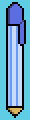

# FGCT4015 Fundamentals of Games Development

## Raylib Project Development Commentary

Name: Harry Lehman  
Date: 05/12/2025

[Repository Link](https://github.com/H-Lehman28/Raylib_Project)  
[Build Link](https://h-lehman.itch.io/pocket-stacker)   

### Project Outline

The original plan for my project was to make a combination between Tetris and match-3 games like Candy Crush. The game's grid would be placed within a clothing pocket, with various objects such as keys, phone, wallet, etc, falling from the top of the screen. When 3 of the same objects are lined up, they would be destroyed. If the objects stack up to the top, a hole would tear in the bottom of the pocket, and the game would be over.

### Research

The brief for this project was to create a game in Raylib centered around the theme "pocket", so when coming up with ideas for a game, my first thought was to create a mobile game. With this, the first game I researched was the classic mobile game Candy Crush.

*Figure 1: Screenshot of Candy Crush gameplay.*

Candy Crush Saga (2012) is a mobile game developed by King. The game is a tile match game where players have to match 3 pieces of candy of the same colour to clear them off the grid and replace them with new ones. The game has been immensely popular, with it reaching $20 billion in lifetime revenue in 2023.(Rousseau, 2023)

After researching Candy Crush, the next step was finding a way to make my game concept unique. I decided to do this by combining the "match 3" concept of Candy Crush with another puzzle game, Tetris.

  
*Figure 2: Screenshot of Tetris gameplay.*

Tetris (1988) is a falling block puzzle game, where various shapes fall from the top of the screen, and the player must move and rotate them to complete rows. Tetris is one of the most popular games of all time, releasing on over 50 platforms and selling over 520 million copies as of 2024 (The Tetris Company, 2024). For my project, I decided to take the "match 3" aspect of Candy Crush and combine it with the falling block puzzle elements of Tetris.

#### Documentation Sources:

- Youtube tutorials
  - [Creating Tetris in C++ with raylib - Beginner Tutorial (OOP)](https://www.youtube.com/watch?v=wVYKG_ch4yM) by Programming With Nick
- Documentation
  - [Raylib Cheatsheet](https://www.raylib.com/cheatsheet/cheatsheet.html)

### Implementation

#### Process

This project was my first time using Raylib, so my first step when creating my game was to follow a tutorial on how to recreate Tetris in raylib, and then work from there.

    int main() 
    {
        InitWindow(500, 620, "Raylib project");
        SetTargetFPS(60);

        Game game = Game();

        while(WindowShouldClose() == false)
        {
            UpdateMusicStream(game.music);
            game.HandleInput();
            if(EventTriggered(0.2))
            {
                game.MoveBlockDown();
            }
            BeginDrawing();
            ClearBackground(DARKBLUE);
            DrawText("Score", 355, 15, 38, WHITE);
            DrawText("High Score", 325, 175, 28, WHITE);
            DrawText("Next", 365, 335, 38, WHITE);
            if(game.gameOver)
            {
                DrawText("GAME OVER", 322, 570, 28, WHITE);
            }
            DrawRectangleRounded({320, 55, 170, 60}, 0.3, 6, BLUE);
            DrawRectangleRounded({320, 215, 170, 60}, 0.3, 6, BLUE);

            char scoreText[10];
            sprintf(scoreText, "%d", game.score);
            int scoreTextSize = MeasureText(scoreText, 38);

            char highScoreText[10];
            sprintf(highScoreText, "%d", game.highScore);
            int highScoreTextSize = MeasureText(highScoreText, 38);

            DrawText(scoreText, 320 + (170 - scoreTextSize)/2, 65, 38, WHITE);
            DrawText(highScoreText, 320 + (170 - highScoreTextSize)/2, 225, 38, WHITE);
            DrawRectangleRounded({320, 375, 170, 180}, 0.3, 6, BLUE);
            game.Draw();
            EndDrawing();
        }
        
        CloseWindow();
    }

*Figure 3: int main from my project code*

This main function is what controls the entire project, allowing the game to run. When the game is running, it moves blocks down one space every 0.2 seconds, draws the grid, background and text on screen, and triggers the blocks to be drawn.

    void Game::Draw()
    {
        grid.Draw();
        currentBlock.Draw(11, 11);
        switch(nextBlock.id)
        {
        case 3:
            nextBlock.Draw(255, 450);
            break;
        case 4:
            nextBlock.Draw(255, 440);
            break;
        default:
            nextBlock.Draw(270, 430);
            break;
        }
    }
*Figure 4: Game.Draw from my project code*

This function is what allows the blocks to be drawn on screen. It calls the draw function in the grid header file to set the variables for current and next blocks, and then draws the current block at the top of the screen and the next block in the "Next Block" square at the side.

    void Game::HandleInput()
    {
        int keyPressed = GetKeyPressed();
        if(gameOver && keyPressed != 0)
        {
            gameOver = false;
            Reset();
        }
        switch(keyPressed)
        {
        case KEY_LEFT:
            MoveBlockLeft();
            break;
        case KEY_RIGHT:
            MoveBlockRight();
            break;
        case KEY_DOWN:
            MoveBlockDown();
            break;  
        case KEY_UP:
            RotateBlock();
            break;    
        }
    }

    void Game::MoveBlockLeft()
    {
        if (!gameOver)
        {
            currentBlock.Move(0,-1);
            if(IsBlockOutside() || BlockFits() == false)
            {
                currentBlock.Move(0, 1);
            }
        }
        
    }

    void Game::MoveBlockRight()
    {
        if (!gameOver)
        {
            currentBlock.Move(0,1);
            if(IsBlockOutside() || BlockFits() == false)
            {
                currentBlock.Move(0, -1);
            }
        }
    }

    void Game::MoveBlockDown()
    {
        if(!gameOver)
        {
            currentBlock.Move(1,0);
            if(IsBlockOutside() || BlockFits() == false)
            {
                currentBlock.Move(-1, 0);
                LockBlock();
            }
        }

    }
*Figure 5: Input handler from my project code*

This segment of code handles the player input, allowing the block to move left, right and down when the player presses the corresponding arrow key.

    bool Game::IsBlockOutside()
    {
        std::vector<Position> tiles = currentBlock.GetCellPositions();
        for(Position item: tiles)
        {
            if(grid.IsCellOutside(item.row, item.column))
            {
                return true;
            }
        }
        return false;
    }

    void Game::RotateBlock()
    {
        if(!gameOver)
        {
            currentBlock.Rotate();
            if(IsBlockOutside() || BlockFits() == false)
            {
                currentBlock.UndoRotation();
            }
            else
            {
                PlaySound(rotateSound);
            }
        }
    }

    void Game::LockBlock()
    {
        std::vector<Position> tiles = currentBlock.GetCellPositions();
        for(Position item: tiles)
        {
            grid.grid[item.row][item.column] = currentBlock.id;
        }
        currentBlock = nextBlock;
        if(BlockFits() == false)
        {
            gameOver = true;
        }
        nextBlock = GetRandomBlock();
        int rowsCleared = grid.ClearFullRows();
        if(rowsCleared > 0)
        {
            PlaySound(clearSound);
            UpdateScore(rowsCleared, 0);
        }
    }

    bool Game::BlockFits()
    {
        std::vector<Position> tiles = currentBlock.GetCellPositions();
        for(Position item: tiles)
        {
            if(grid.IsCellEmpty(item.row, item.column) == false)
            {
                return false;
            }
        }
        return true;
    }
*Figure 6: Input handler from my project code continued*

These scripts handle the rotation of the blocks, along with preventing the blocks from moving outside of the grid. The scripts also lock blocks in place once they can no longer move, and triggers a row clear once a row is full.

    void Grid::Draw()
    {
        for(int row = 0; row < numRows; row++)
        {
            for(int column = 0; column < numCols; column++)
            {
                int cellValue = grid[row][column];
                DrawRectangle(column * cellSize + 11, row * cellSize + 11, cellSize - 1, cellSize - 1, colors[cellValue]);
            }
        }
    }
*Figure 7: Block draw function from my project code*

This function is what draws the blocks on screen, with their positions and colour being determined by the block's ID.

    int Grid::ClearFullRows()
    {
        int completed = 0;
        for(int row = numRows-1; row >= 0; row--)
        {
            if(IsRowFull(row))
            {
                ClearRow(row);
                completed++;
            }
            else if (completed > 0)
            {
                MoveRowDown(row, completed);
            }
        }
        return completed;
    }

    bool Grid::IsRowFull(int row)
    {
        for(int column = 0; column < numCols; column++)
        {
            if(grid[row][column] == 0)
            {
                return false;
            }
        }
        return true;
    }

    void Grid::ClearRow(int row)
    {
        for(int column = 0; column < numCols; column++)
        {
            grid[row][column] = 0;
        }
    }

    void Grid::MoveRowDown(int row, int numRows)
    {
        for(int column = 0; column < numCols; column++)
        {
            grid[row + numRows][column] = grid[row][column];
            grid[row][column] = 0;
        }
    }
*Figure 8: Row clear functions from my project code*

This code is what determines if a row has been completed, and if so it destroys all the blocks in the row and moves all the blocks above that row down.

Once I had implemented the basic Tetris functions into the game, the next step was creating custom sprites for the game. I started by creating sprites for all of the shape blocks, with each one containing a different item that would typically be placed in a pocket, such as a phone, a pen or a wallet.

  
*Figure 9: Custom I-Block sprite for my project*

However, due to several issues such as a lack of knowledge or experience developing games in raylib, my own poor time management and a struggle with getting motivation to do work, not only was I unable to figure out a way to implement the "match 3" mechanics I had planned, but I was also unable to figure out how to implement the custom sprites I had created before the submission deadline, which meant that my final product was simply just a copy of Tetris and nothing else.

### Outcome

[Itch.io page for my game](https://h-lehman.itch.io/pocket-stacker)

#### Instructions To Install/Run

In install the game, you simply go to the itch.io page linked above and click the download button to install the .zip file. Extract the zip file and run the game application in the folder to play the game. It may require you to install [raylib](https://www.raylib.com/) on your computer in order to run the game.

### Reflection

The main positive outcome of this project is that I was able to learn a lot about developing games in Raylib. However, I overall feel that this project has been unsuccessful for many reasons. Firstly, my own poor time management meant that many aspects of this project were left until the last minute, meaning I did not have time to fully achieve my aims for the project, such as implementing custom graphics and the "match three" gameplay. Secondly, because the game was finished so late, I did not have time to gather any data from user testing. Finally, while I feel that my research helped with giving me inspiration for the project, much of it did not apply to the end result due to the unfinished aspects of the game.

Through this project I have learned that I need to manage my time much better for future projects in order to fully achieve my aims. However, this project has also taught me a lot about making games using C++, and I will take what I've learned during this project and apply it to future games that I work on.

### Declared Assets
- Sound effects created using [jsfxr](https://sfxr.me/)
- "Arcade Beat" made by [NoCopyrightSound633 on Pixabay](https://pixabay.com/users/nocopyrightsound633-47610058/)
- Custom block sprites created using [Libresprite](https://libresprite.github.io/#!/)

### References

- Candy Crush Saga (2012) At: https://play.google.com/store/apps/details?id=com.king.candycrushsaga&hl=en_GB (Accessed 05/12/2025)  
- Rousseau, J (2023) 'King's Candy Crush Saga hits $20bn in lifetime revenue' In: GamesIndustry.biz At: https://www.gamesindustry.biz/kings-candy-crush-saga-hits-20bn-in-lifetime-revenue (Accessed 05/12/2025)  
- Tetris (1988) At: https://play.tetris.com/ (Accessed 05/12/2025)  
- The Tetris Company (2024) 'Tetris By The Numbers' At: https://web.archive.org/web/20241206233755/https://tetris.com/by-the-numbers (Accessed 05/12/2025)

### List of Illustrations

- Fig. 1: Screenshot of Candy Crush gameplay (2014) At: https://www.nbcnews.com/nightly-news/addicted-candy-crush-sweet-heres-why-n32981 (Accessed 05/12/2025)  
- Fig. 2: Screenshot of Tetris gameplay (1989) At: https://www.ebay.co.uk/itm/374941064104 (Accessed 05/12/2025)
- Fig. 3: int main from my project code (2025)
- Fig. 4: Game.Draw from my project code (2025)
- Fig. 5: Input handler from my project code (2025)
- Fig. 6: Input handler from my project code continued (2025)
- Fig. 7: Block draw function from my project code (2025)
- Fig. 8: Row clear functions from my project code (2025)
- Fig. 9: Custom I-Block sprite for my project (2025)